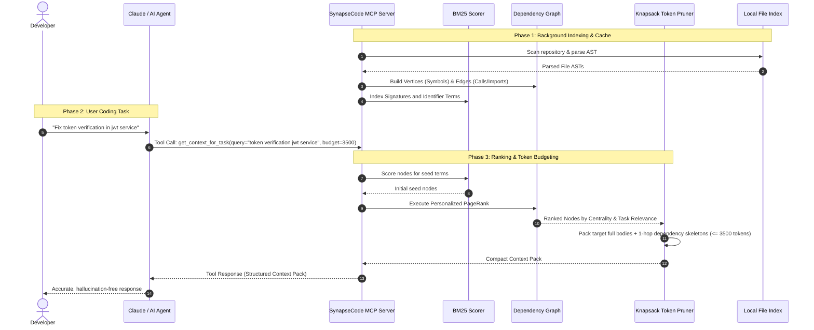

# Technical Architecture & Algorithms: SynapseCode

## 1. System Pipeline and Data Flow

---

## 2. Graph Mathematical Formulation

The codebase is represented as a directed multi-edge graph:
$$G = (V, E)$$

### 2.1 Vertices ($V$)
A vertex $v \in V$ represents a file or code symbol:
* Attributes: `ID`, `FilePath`, `SymbolName`, `Kind`, `Signature`, `Documentation`, `TokenCostFull`, `TokenCostSkeleton`.

### 2.2 Edges ($E$)
An edge $e = (u, v) \in E$ denotes a directed relationship:
* `CALLS`: Function $u$ invokes function $v$ ($w = 1.0$).
* `IMPORTS`: File $u$ imports module $v$ ($w = 0.5$).
* `DEFINES`: File $u$ declares symbol $v$ ($w = 1.0$).
* `IMPLEMENTS`: Struct $u$ implements interface $v$ ($w = 1.2$).
* `EXTENDS`: Class $u$ inherits from class $v$ ($w = 1.2$).

---

## 3. Personalized PageRank Algorithm

Given a task query $Q$:

1. **Personalization Vector ($\mathbf{p}_0$)**:
   BM25 lexical scoring computes relevance score $s(v, Q)$ for each node $v \in V$.
   $$\mathbf{p}_0(v) = \frac{s(v, Q)}{\sum_{u \in V} s(u, Q)}$$

2. **Power Iteration ($\alpha = 0.85$)**:
   $$\mathbf{p}_{k+1} = \alpha \mathbf{M}^T \mathbf{p}_k + (1 - \alpha) \mathbf{p}_0$$
   where $\mathbf{M}$ is the row-normalized transition matrix.

3. **Convergence**:
   Iteration terminates when $||\mathbf{p}_{k+1} - \mathbf{p}_k||_1 < 10^{-6}$ or maximum iterations ($25$) are reached.
   Sorting is deterministically stabilized with secondary node ID tie-breaking.

---

## 4. Knapsack Selection and Token Budgeting

Let $B$ be the maximum token budget (e.g., $3,500$ tokens):
1. **Primary Targets**: The top ranked nodes (up to 3) include full implementation bodies if available.
2. **First-Hop Dependencies**: Adjacent callers and callees are represented solely as signatures and type declarations.
3. **Budget Constraint**: The selector terminates as soon as adding the next element would exceed $B - 200$ tokens (reserving buffer for Markdown formatting headers).

---

## 5. Model Context Protocol Specification

SynapseCode implements JSON-RPC 2.0 protocol over standard input/output (`stdio`), exposing three primary tools:

### `get_repo_map`
* **Description**: Returns an overview of total files, symbols, and architectural components under a token budget.
* **Parameters**: `budget_tokens` (number, optional, default: 2000).

### `get_context_for_task`
* **Description**: Extracts relevant target implementations and 1-hop skeletons for a specific task.
* **Parameters**: `task_description` (string, required), `budget_tokens` (number, optional, default: 3500).

### `get_symbol_callers`
* **Description**: Queries all incoming callers of a specific symbol across the codebase.
* **Parameters**: `symbol_name` (string, required).
