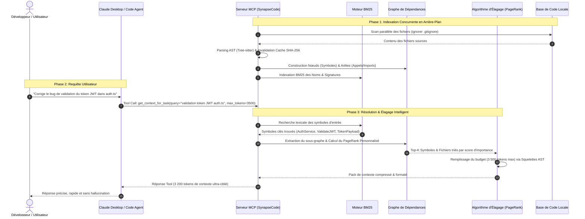

# ARCHITECTURE TECHNIQUE & ALGORITHMES: SynapseCode

> **Document de Référence Technique pour Architectes et Développeurs**  
> *Décrit le modèle mathématique de graphe, les algorithmes d'élagage de contexte et le protocole de communication MCP.*

---

## 1. Vue d'Ensemble des Flux de Données



---

## 2. Modèle Mathématique du Graphe de Code

Le code source est modélisé sous forme d'un **Graphe Orienté Multi-Attributs** :
$$G = (V, E)$$

### Nœuds ($V$) :
Chaque nœud $v \in V$ représente une entité du code :
* **Type $v_{\text{type}}$** : `FILE`, `CLASS`, `STRUCT`, `INTERFACE`, `FUNCTION`, `METHOD`, `TYPE_ALIAS`.
* **Attributs** :
  * `path` : Chemin du fichier source.
  * `signature` : Déclaration sans le corps (ex: `func Verify(token string) (*Claims, error)`).
  * `docstring` : Commentaires et documentation associée.
  * `body_range` : Lignes de début et fin de l'implémentation brute.
  * `token_cost_full` : Coût en tokens du code complet.
  * `token_cost_skeleton` : Coût en tokens de la signature seule.

### Arêtes ($E$) :
Chaque arête $e = (u, v) \in E$ représente une relation dirigée de $u$ vers $v$ avec un type et un poids :
* `CALLS` ($w = 1.0$) : La fonction $u$ appelle la fonction $v$.
* `IMPORTS` ($w = 0.5$) : Le fichier $u$ importe le fichier/module $v$.
* `IMPLEMENTS` ($w = 1.2$) : La struct/classe $u$ implémente l'interface $v$.
* `EXTENDS` ($w = 1.2$) : La classe $u$ hérite de la classe $v$.
* `CONTAINS` ($w = 0.8$) : Le fichier $u$ déclare le symbole $v$.

---

## 3. Algorithme de PageRank Personnalisé (PPR)

Lorsqu'une tâche $Q$ est soumise par l'utilisateur :

1. **Vecteur de Téléportation initial $\mathbf{p}_0$** :
   Le moteur BM25 calcule un score de similarité $s(v, Q)$ pour chaque nœud $v$. Le vecteur initial est normalisé :
   $$\mathbf{p}_0(v) = \frac{s(v, Q)}{\sum_{u \in V} s(u, Q)}$$

2. **Itération de PageRank avec Facteur d'Amortissement ($\alpha = 0.85$)** :
   $$\mathbf{p}_{k+1} = \alpha \mathbf{M}^T \mathbf{p}_k + (1 - \alpha) \mathbf{p}_0$$
   où $\mathbf{M}$ est la matrice de transition stochastique des arêtes de dépendance.

3. **Convergence** :
   Après 15 à 20 itérations (quelques millisecondes en Go), le vecteur $\mathbf{p}^*$ fournit le classement de pertinence de chaque fonction et fichier du projet par rapport à la tâche de l'utilisateur.

---

## 4. Algorithme d'Élagage et Remplissage du Budget (Token Knapsack)

Une fois les nœuds classés par pertinence décroissante $v_1, v_2, \dots, v_n$ :

```
Entrée: BudgetMax (ex: 3500 tokens), Nœuds triés [v_1, v_2, ...]
Sortie: Contexte Markdown condensé

BudgetRestant = BudgetMax
Pour chaque nœud v_i dans l'ordre de pertinence:
    Si v_i est le Nœud Cible Principal (Top 1 à 3):
        Si CoûtComplet(v_i) <= BudgetRestant:
            Ajouter CodeComplet(v_i)
            BudgetRestant -= CoûtComplet(v_i)
        Sinon:
            Ajouter Squelette(v_i)
            BudgetRestant -= CoûtSquelette(v_i)
    Sinon (Nœud Voisin / Dépendance de 1er saut):
        Si CoûtSquelette(v_i) <= BudgetRestant:
            Ajouter Squelette(v_i)
            BudgetRestant -= CoûtSquelette(v_i)

Si BudgetRestant >= 300 tokens:
    Ajouter RepoMapCondensée(BudgetRestant)
```

---

## 5. Invalidation de Cache & Indexation Incrémentale

Pour garantir une réactivité instantanée même sur des projets de 500 000 lignes de code :

1. **Table d'empreintes SHA-256** :
   Chaque fichier est indexé avec un hash SHA-256 de son contenu et son `mtime`.
2. **Scan différentiel** :
   Au démarrage ou lors d'un événement `fsnotify` :
   - Fichier inchangé $\to$ Zéro ré-analyse AST.
   - Fichier modifié $\to$ Suppression des anciens nœuds/arêtes liés à ce fichier dans le graphe, ré-analyse Tree-sitter du fichier uniquement (5ms), et ré-insertion des nouvelles arêtes.

---

## 6. Spécification des Outils MCP (Model Context Protocol)

Le serveur SynapseCode expose 3 outils normalisés via JSON-RPC 2.0 :

### Outil 1 : `get_repo_map`
* **Description** : Renvoie la carte structurelle compacte du projet (arborescence des répertoires, interfaces et fonctions maîtresses).
* **Paramètres** :
  - `budget_tokens` *(integer, optional, default: 2000)* : Budget maximal alloué.
* **Sortie** : Markdown structuré avec balises de code.

### Outil 2 : `get_context_for_task`
* **Description** : Analyse la tâche demandée, traverse le graphe de dépendances et renvoie le code source exact des fonctions cibles accompagné des squelettes de leurs dépendances directes.
* **Paramètres** :
  - `task_description` *(string, required)* : Description ou prompt de la tâche.
  - `budget_tokens` *(integer, optional, default: 3500)* : Budget de tokens.
  - `include_callers` *(boolean, optional, default: true)* : Inclure les appelants pour éviter les régressions.
* **Sortie** : Fichiers cibles avec implémentation + signatures des voisins.

### Outil 3 : `get_symbol_callers`
* **Description** : Fournit la liste exhaustive des fonctions qui appellent un symbole donné dans toute la base de code.
* **Paramètres** :
  - `symbol_name` *(string, required)* : Nom de la fonction ou méthode.
  - `file_path` *(string, optional)* : Fichier de définition pour désambiguïsation.
* **Sortie** : Arbre d'appels ascendant avec chemins de fichiers et lignes.
