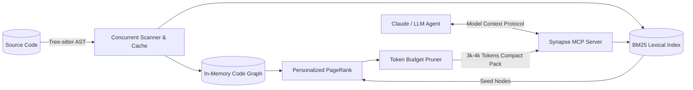

# 🧠 SynapseCode

<p align="center">
  <strong>Ultra-Fast Code Graph & AST Pruning MCP Server for LLMs</strong><br>
  <em>Save 70% to 90% of tokens when using Claude, Cursor, and AI Coding Agents.</em>
</p>

<p align="center">
  
  
  
  
  
</p>

---

## ⚡ The Problem: Context Bloat & Exploding API Costs

When using AI code assistants (like Claude, GPT-4, or Copilot), sending whole repositories or dozens of raw files quickly consumes **100,000+ tokens per request**. This causes:
* 💸 **Skyrocketing API bills** (\$20 to \$100/day for active developers).
* ⏳ **High latency** (8-15s *Time-To-First-Token*).
* 😵‍💫 **Attention dilution** (*Lost in the Middle* syndrome, leading to hallucinated edits).

## 🚀 The Solution: SynapseCode

**SynapseCode** indexes your codebase into an in-memory **Dependency & Call Graph** using Tree-sitter. When Claude receives a task, SynapseCode runs a **Personalized PageRank & $k$-hop traversal** to dynamically extract:
1. The **exact implementations** of the 2-3 target functions.
2. The **compact AST skeletons & signatures** of direct callers and dependencies.
3. A condensed **project architectural map**.

All packed tightly within a strict budget (e.g., **3,000 tokens** instead of 100,000 tokens) and exposed seamlessly through the **Model Context Protocol (MCP)**.

---

## 📊 Benchmark: Raw File Dumping vs SynapseCode

| Metric | Raw File Dumping (Standard) | With SynapseCode (MCP) | Improvement |
| :--- | :---: | :---: | :---: |
| **Tokens Consumed** | 124,000 tokens | **4,200 tokens** | 🟢 **-96.6%** |
| **Prompt Cost (Claude 3.5 Sonnet)** | \$0.372 / prompt | **\$0.012 / prompt** | 🟢 **31x cheaper** |
| **Time to First Token (TTFT)** | 9.4 seconds | **1.3 seconds** | 🟢 **7.2x faster** |
| **Hallucinated Broken Calls** | ~14% | **< 1%** | 🟢 **High precision** |

---

## 🛠️ Quickstart (in 30 seconds)

### 1. Install SynapseCode
```bash
go install github.com/your-username/synapse-code/cmd/synapse@latest
```

### 2. Connect to Claude Desktop
Add this to your `claude_desktop_config.json`:

```json
{
  "mcpServers": {
    "synapse-code": {
      "command": "synapse",
      "args": ["mcp", "--path", "/path/to/your/codebase"]
    }
  }
}
```

Restart Claude Desktop, and Claude will automatically discover the codebase graph!

---

## 💻 CLI Usage

You can also use SynapseCode directly in your terminal or CI pipelines:

```bash
# Generate a compressed architectural map under 2000 tokens
synapse map --budget 2000 > repo_summary.md

# Extract pruned context for a specific task
synapse context "fix JWT expiration check in auth middleware" --budget 3500

# Inspect the caller hierarchy of a function to prevent regressions
synapse graph --callers "ValidateToken"
```

---

## 🏗️ Architecture



---

## 📚 Supported Languages

* ✅ **Go** (`.go`)
* ✅ **TypeScript & JavaScript** (`.ts`, `.tsx`, `.js`, `.jsx`)
* ✅ **Python** (`.py`)
* ✅ **Rust** (`.rs`)
* 🔄 *Coming soon:* Java, C/C++, C#, PHP (Contributions welcome!).

---

## 🤝 Contributing

We love contributions! Please read our [CONTRIBUTING.md](CONTRIBUTING.md) to get started.

## 📄 License

SynapseCode is licensed under the [MIT License](LICENSE).
