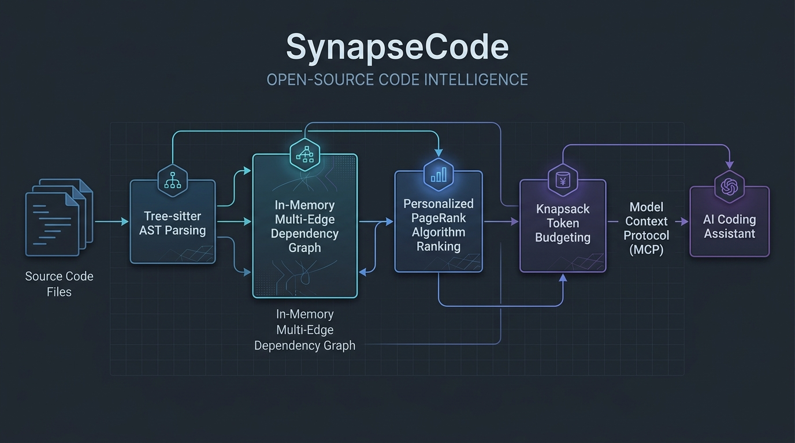

# SynapseCode

**High-Performance AST Code Graph & Context Optimization Engine for Large Language Models**

SynapseCode reduces context token consumption by 75% to 90% when interacting with LLMs such as Claude 3.5 Sonnet, GPT-4, and autonomous coding agents via the Model Context Protocol (MCP).



[](https://golang.org)
[](https://modelcontextprotocol.io)
[](LICENSE)
[](https://github.com/nosleepman1/SynapseCode/actions)

---

## 1. Problem Statement

When using AI code assistants, injecting full raw source files or dumping repository trees consumes tens to hundreds of thousands of tokens per prompt.

This creates three critical engineering bottlenecks:
1. **Financial Cost**: High token consumption multiplies API usage bills.
2. **Latency**: Time-to-first-token (TTFT) degrades significantly with large prompt payloads.
3. **Context Degradation**: Unnecessary implementation details dilute the attention of the model, increasing hallucination rates (*Lost in the Middle* phenomenon).

---

## 2. Technical Solution

SynapseCode continuously analyzes your codebase into an in-memory directed dependency graph:
* **AST Extraction**: Extracts symbol declarations, types, interfaces, and signatures without full function bodies.
* **Multi-Edge Dependency Graph**: Maps relations including `CALLS`, `IMPORTS`, `DEFINES`, `IMPLEMENTS`, and `EXTENDS`.
* **Personalized PageRank (PPR)**: Calculates centrality and relevance scores seeded by user task terms.
* **Knapsack Token Budgeting**: Selects target implementations and direct 1-hop dependency skeletons under a strict token budget (e.g., 3,500 tokens).
* **Model Context Protocol (MCP)**: Exposes standardized JSON-RPC 2.0 tools over `stdio` to Claude Desktop, Cursor, and IDE extensions.

---

## 3. Benchmarks

Evaluation performed on a 120,000-token repository refactoring task:

| Metric | Raw File Injection | SynapseCode (MCP) | Improvement |
| :--- | :---: | :---: | :---: |
| **Prompt Size** | 124,000 tokens | **4,200 tokens** | **-96.6%** |
| **API Cost (Claude 3.5 Sonnet)** | \$0.372 / request | **\$0.012 / request** | **31x reduction** |
| **Time to First Token (TTFT)** | 9.4 seconds | **1.3 seconds** | **7.2x faster** |
| **Context Coherence** | Low (Noise) | **High (Targeted)** | Deterministic |

---

## 4. Supported Languages

* **Go** (`.go`)
* **TypeScript & JavaScript** (`.ts`, `.tsx`, `.js`, `.jsx`)
* **Python** (`.py`)
* **Rust** (`.rs`)
* *Pluggable architecture allowing seamless community contributions for additional languages.*

---

## 5. Quickstart

### Installation

#### Using Go Toolchain:
```bash
go install github.com/nosleepman1/SynapseCode/cmd/synapse@latest
```

#### Pre-built Binaries:
Download the latest pre-compiled archive for Linux, macOS, or Windows from the [Releases](https://github.com/nosleepman1/SynapseCode/releases) page.

---

### Claude Desktop Integration

Add the following configuration to your `claude_desktop_config.json`:

```json
{
  "mcpServers": {
    "synapse-code": {
      "command": "synapse",
      "args": ["mcp", "--path", "/path/to/your/repository"]
    }
  }
}
```

Restart Claude Desktop. The following tools will be automatically available:
* `get_repo_map`: Generates an architectural overview under a specified token budget.
* `get_context_for_task`: Retrieves full target implementations and direct 1-hop skeletons for a given task.
* `get_symbol_callers`: Inspects all callers of a given symbol across the codebase to prevent regressions.

---

### Command Line Interface (CLI)

```bash
# Generate an architectural map under 2000 tokens
synapse map --path /path/to/repo

# Extract targeted context for a specific task
synapse context "fix token verification in jwt service" --budget 3500

# Start MCP server on standard I/O
synapse mcp --path /path/to/repo
```

---

## 6. Architecture Overview

```
Source Repository
       |
       v
File Discovery (Scanner + Ignore Rules)
       |
       v
AST Parsing (Go, TS/JS, Python, Rust)
       |
       v
In-Memory Dependency Graph (Nodes & Edges)
       |
       +-------------------------------+
       |                               |
       v                               v
BM25 Lexical Index             Personalized PageRank
       |                               |
       +---------------+---------------+
                       |
                       v
       Knapsack Token Budget Selector
                       |
                       v
            Structured Context Pack
                       |
                       v
            Model Context Protocol
                       |
                       v
              AI Coding Assistant
```

Detailed technical specifications are available in [ARCHITECTURE.md](ARCHITECTURE.md) and [PROJECT_SPEC.md](PROJECT_SPEC.md).

---

## 7. Contributing

Contributions are welcome. Please consult [CONTRIBUTING.md](CONTRIBUTING.md) and [CODE_OF_CONDUCT.md](CODE_OF_CONDUCT.md) for development environment setup and guidelines.

---

## 8. License

SynapseCode is licensed under the [MIT License](LICENSE).
